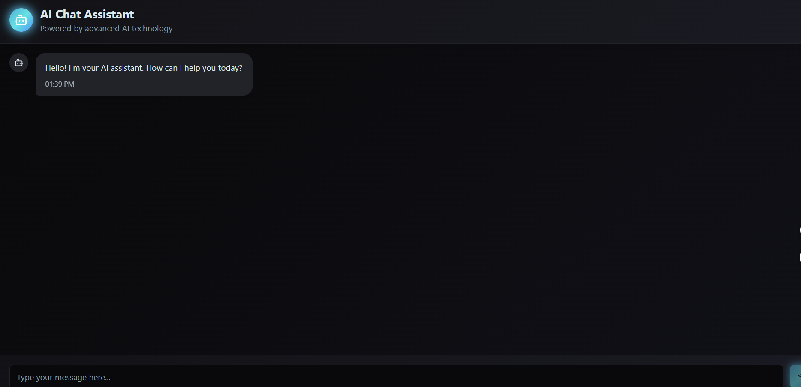

# Chatter AI Wave

A beautiful wave-themed chat interface built with Next.js, featuring both frontend and backend capabilities.



## Features

- 🌊 Beautiful wave-themed UI with smooth animations
- 🤖 AI chat interface with realistic typing indicators
- 🔄 Responsive design that works on all devices
- 🌐 Built-in API for handling chat messages
- 🌙 Dark mode support
- 🎨 Fully customizable UI components using shadcn/ui

## Tech Stack

- **Frontend**: Next.js 14, React 18, Tailwind CSS
- **Backend**: Next.js API Routes
- **UI Components**: shadcn/ui (based on Radix UI)
- **Styling**: Tailwind CSS with custom wave theme
- **Animation**: Custom keyframe animations
- **Type Safety**: TypeScript

## Getting Started

## Getting Started

1. Clone the repository:

   ```bash
   git clone https://github.com/kiganyamburu/chatter-ai-wave.git
   cd chatter-ai-wave
   ```

2. Install dependencies:

   ```bash
   npm install
   # or
   yarn install
   # or
   pnpm install
   # or
   bun install
   ```

3. Run the development server:

   ```bash
   npm run dev
   # or
   yarn dev
   # or
   pnpm dev
   # or
   bun dev
   ```

4. Open [http://localhost:3000](http://localhost:3000) with your browser to see the result.

## Project Structure

```
/
├── app/                  # Next.js App Router
│   ├── api/              # API routes
│   │   └── chat/         # Chat API endpoint
│   ├── globals.css       # Global styles
│   ├── layout.tsx        # Root layout
│   └── page.tsx          # Home page
├── components/           # React components
│   ├── ui/               # UI components
│   └── ChatInterface.tsx # Main chat component
```

## Extending the Chat API

The chat API is implemented as a Next.js API route at `/app/api/chat/route.ts`. You can extend it to connect to an actual AI service:

```typescript
// Example of connecting to an external AI service
import { OpenAI } from "openai";

// Initialize the OpenAI client
const openai = new OpenAI({
  apiKey: process.env.OPENAI_API_KEY,
});

export async function POST(request: Request) {
  try {
    const body = await request.json();
    const { message } = body;

    // Call OpenAI API
    const completion = await openai.chat.completions.create({
      messages: [{ role: "user", content: message }],
      model: "gpt-3.5-turbo",
    });

    return NextResponse.json({
      response:
        completion.choices[0]?.message.content || "No response generated",
    });
  } catch (error) {
    console.error("Chat API error:", error);
    return NextResponse.json(
      { error: "Failed to process message" },
      { status: 500 }
    );
  }
}
```

## Deployment

You can deploy this Next.js application to platforms like Vercel, Netlify, or any other hosting service that supports Next.js.

For the best experience, deploy to [Vercel](https://vercel.com/new?utm_medium=default-template&filter=next.js).

## Scripts

- `pnpm dev` — Start development server
- `pnpm build` — Build for production
- `pnpm preview` — Preview production build
- `pnpm lint` — Lint codebase

## License

This project is open source and available under the [MIT License](LICENSE).
This project is open source and available under the [MIT License](LICENSE).
This project is open source and available under the [MIT License](LICENSE).
This project is open source and available under the [MIT License](LICENSE).
```

```
